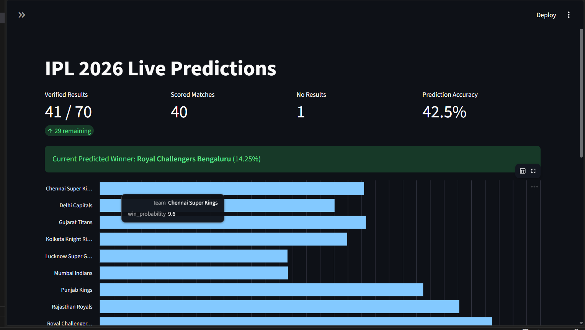
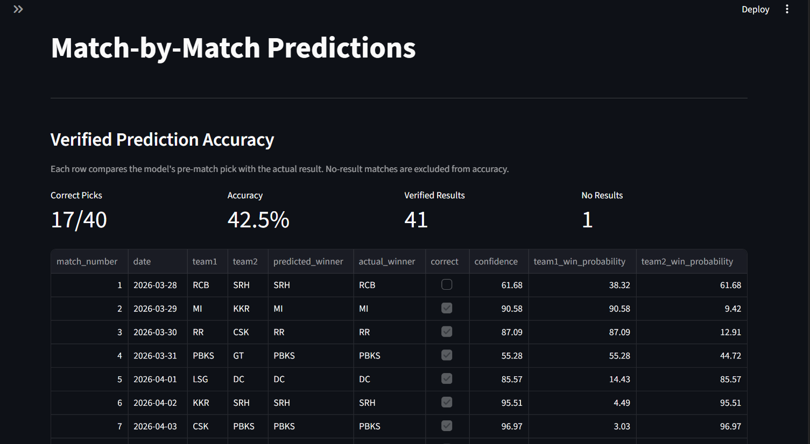

# IPL 2026 Live Predictor

A live IPL 2026 prediction system built on top of an existing IPL winner prediction pipeline, extended with **match-by-match forecasting**, **live result ingestion**, and a **Streamlit dashboard**.

It uses 17 years of IPL ball-by-ball data (2008-2025) and updates predictions as completed 2026 matches are added.

## What I Added

- Converted tournament-only prediction into **match-by-match prediction**
- Added **live score/result integration** for 2026 updates
- Added **partial-season forecasting** with completed matches locked in
- Added **dynamic feature refresh** after each verified result
- Built a **Streamlit dashboard** to track winner odds, points table, and prediction accuracy
- Evaluated how well the pipeline performs on **real IPL 2026 matches**

## 2026 Validation Snapshot

| Metric | Value |
|---|---:|
| Verified results | 41 / 70 |
| Scored matches | 40 |
| No results | 1 |
| Correct picks | 17 |
| Prediction accuracy | 42.5% |
| Current predicted winner | Royal Challengers Bengaluru (14.25%) |

> Note: Accuracy is computed only on completed matches with a winner. No-result matches are excluded.

## Key Findings

- The original pipeline was stronger as a **tournament-level system** than as a pure match winner predictor
- Real-season match prediction is much harder than offline test performance suggests
- Live updates, form shifts, and match context make the system more useful operationally, even when accuracy is still modest
- The project is best positioned as a **live cricket intelligence system**, not just a single accuracy number

## Features

- **Live Score Integration** via CricketData/CricAPI workflow
- **Match-by-Match Predictions** for all fixtures
- **Dynamic Bayesian Weights** across season stages
- **5 ML Models + Ensemble**: Random Forest, XGBoost, LightGBM, Neural Network, ExtraTrees
- **Streamlit Dashboard** with leaderboard, points table, and prediction tracking
- **Playoff Bracket Logic** for Q1, Eliminator, Q2, and Final scenarios

## Dashboard Preview

### Live Predictions Overview


### Match-by-Match Prediction



## Model Performance

| Model | CV Accuracy | Test Accuracy | Test AUC |
|---|---:|---:|---:|
| Random Forest | 0.6350 | 0.6711 | 0.6995 |
| XGBoost | 0.6284 | 0.6600 | 0.7133 |
| LightGBM | 0.6477 | 0.6600 | 0.7138 |
| Neural Network | 0.6080 | 0.6049 | 0.6141 |
| ExtraTrees | 0.6444 | 0.6512 | 0.7083 |
| Ensemble | - | 0.6446 | 0.7058 |

## Quick Start

```bash
pip install -r requirements.txt
python main.py --mode all
streamlit run app.py
```

For live updates:

```bash
python main.py --mode live --api-key YOUR_CRICAPI_KEY
```

## Project Structure

```text
ipl-2026-live-predictor/
├── app.py
├── main.py
├── config.py
├── data/
│   ├── raw/
│   ├── processed/
│   ├── db/
│   └── live/
├── src/
│   ├── data/
│   ├── features/
│   ├── models/
│   ├── prediction/
│   └── live/
├── outputs/
├── notebooks/
└── tests/
```

## Credits

- Original tournament prediction pipeline by [manpatell](https://github.com/manpatell/IPL-Winner-Prediction-2026)
- Live extensions, dashboard, match-by-match prediction flow, and 2026 evaluation by [ShivamaniG](https://github.com/ShivamaniG)

## License

MIT